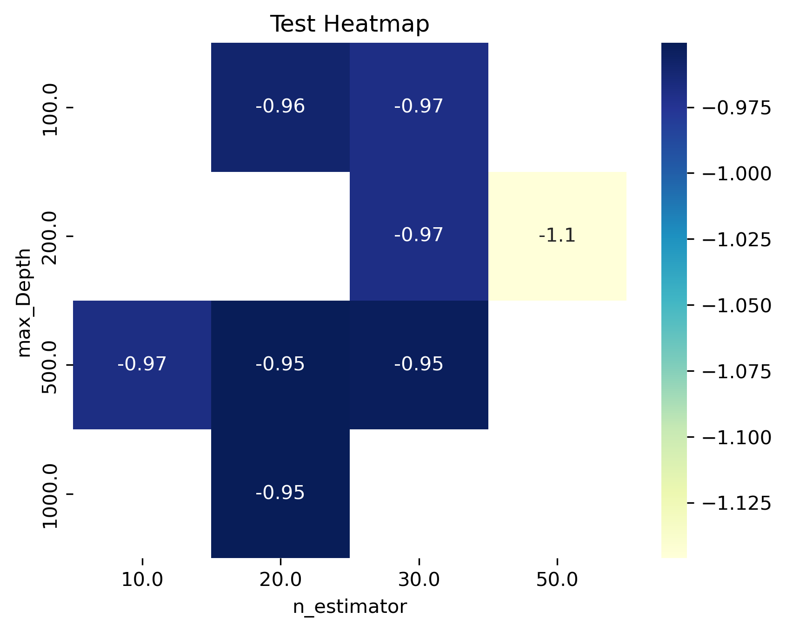
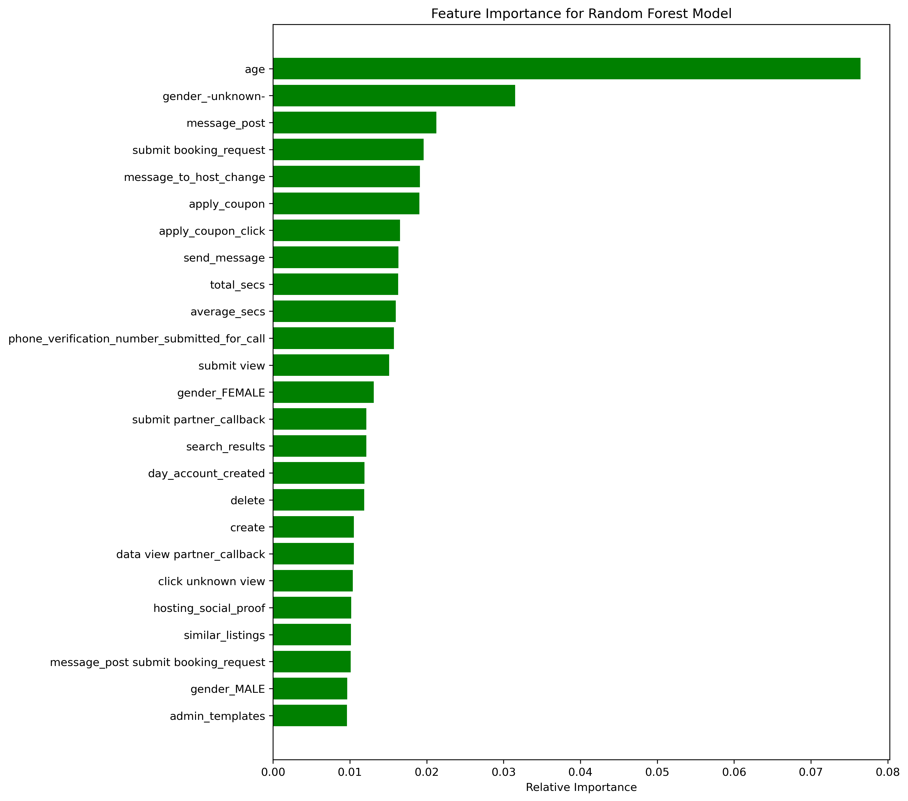

# Airbnb New User Prediction 🏡✈️

This repository contains my **practice** for the **Airbnb New User Prediction** challenge from [Kaggle](https://www.kaggle.com/competitions/airbnb-recruiting-new-user-bookings). The goal is to predict the first destination a new user will book, allowing Airbnb to improve user experience through personalized recommendations.

🔹 I have used this [GitHub Repo](https://github.com/NamrataThakur/Airbnb-New-User-Prediction?source=post_page-----e26e712fe8d2--------------------------------) as my base code with modifcations. 

---

## 📌 Business Problem
Airbnb aims to **predict the first travel destination** of a new user based on their demographics, sign-up details, and browsing behavior. By improving these predictions, Airbnb can:
- Enhance **personalized marketing** strategies.
- **Reduce the time to first booking** for new users.
- Improve **demand forecasting** for different locations.

**🛠️ Objective:** Develop a **machine learning model** that accurately predicts the top 5 most probable destinations for a new user.

---

## 🎯 Defining the Problem as a Machine Learning Task
This is a **multi-class classification problem**, where the target variable (`country_destination`) consists of **10 possible destinations**. 

🔹 Given a new user’s profile, we aim to predict the **top 5 most probable destinations**.  

🔹 The problem is tackled using **supervised learning**, with **multi-class probability predictions**.

---

## 📊 Dataset Overview
The competition provides multiple datasets:

| **Dataset** | **Description** |
|------------|---------------|
| `train_users_2.csv` | 213,451 users with **16 features** (e.g., age, gender, signup method) and their first destination. |
| `test_users.csv` | 62,096 users with **15 features**, excluding the `country_destination` target. |
| `sessions.csv` | Logs of user interactions (e.g., action type, action detail), available for 135,483 users. |
| `countries.csv` | General information about the **10 possible destinations**. |
| `age_gender_bkts.csv` | Demographic data on **male users** grouped by **age and destination**. |

**🔹 Challenge:** Some users have missing values or incomplete session data, requiring careful **data preprocessing**.

---

## 📏 Performance Metrics
I use **Negative Log Loss (NLL)**, a probability-based metric (the original competition use normalized discounted cumulative gain). 

🔹 **Why Log Loss?**  
I opt for NLL for simplicity of the case study. Log loss ensures the model not only predicts the correct class but also assigns high probabilities to the correct predictions.

---

## 🔍 Exploratory Data Analysis (EDA)
### Key Steps:
- **Data Cleaning**: Handling missing values and outliers.
- **Feature Distributions**: Analyzing `age`, `gender`, and `signup_method` trends.
- **User Behavior Analysis**: Understanding signup patterns and session activity.
- **Correlation Analysis**: Finding relationships between features and target destinations.

---

## 🛠️ Feature Engineering
To improve model performance, I created new features, including:
- **Session-based features**: Aggregated session duration, and average session duration among others. 

🔹 **Preprocessing Steps**:
- One-hot encoding categorical features.
- Handling missing values.
  
---

## 🤖 Modeling Approach
I experimented with several models:
1. **Logistic Regression** – A simple baseline model.
2. **Random Forest** – Achieved the best performance.
3. **XGBoost** – Tuned but performed slightly worse than Random Forest.
4. **Naive Bayes** – Used for comparison but had lower predictive power.

### **Hyperparameter Tuning for Random Forest**
Grid Search was used to optimize:
- `n_estimators`: Number of trees.
- `max_depth`: Maximum depth of trees.

**📊 Heatmap of Cross-Validation Performance:**

### **Feature Importance (Random Forest)**
Feature ranking based on Gini importance:

---

## 🏆 Results & Insights
- The **Random Forest model** provided the **best log loss score**.
- **Session-based features** significantly improved prediction accuracy.
- **Age** are strong indicators of future destination choices.

🔹 **Next Steps:**
- Try **deep learning models** (e.g., Neural Networks).
- Perform **further feature engineering** using NLP on session actions.
- Optimize hyperparameters for **XGBoost and LightGBM**.

---

## 📚 References
- [Kaggle Competition](https://www.kaggle.com/competitions/airbnb-recruiting-new-user-bookings)
- [GitHub Repo](https://github.com/NamrataThakur/Airbnb-New-User-Prediction?source=post_page-----e26e712fe8d2--------------------------------)

---

